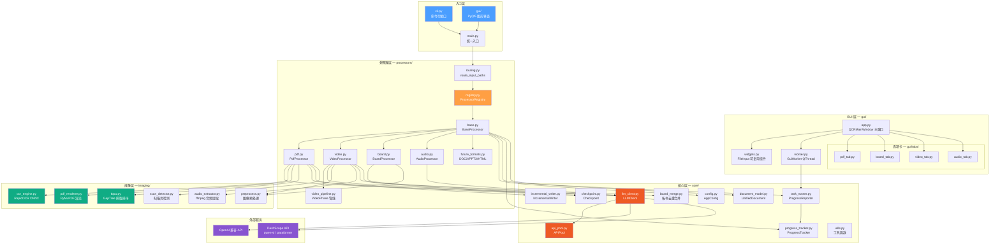

# OCRLLM 分层架构图

```mermaid
graph TB
    subgraph "入口层"
        CLI["cli.py<br/>命令行接口"]
        GUI["gui/<br/>PyQt5 图形界面"]
        MAIN["main.py<br/>统一入口"]
    end

    subgraph "GUI 层 — gui/"
        APP["app.py<br/>QCRMainWindow 主窗口"]
        WIDGETS["widgets.py<br/>FileInput 可复用组件"]
        WORKER["worker.py<br/>GuiWorker QThread"]
        subgraph "选项卡 — gui/tabs/"
            PDF_TAB["pdf_tab.py"]
            BOARD_TAB["board_tab.py"]
            VIDEO_TAB["video_tab.py"]
            AUDIO_TAB["audio_tab.py"]
        end
    end

    subgraph "处理器层 — processors/"
        REGISTRY["registry.py<br/>ProcessorRegistry"]
        ROUTING["routing.py<br/>route_input_paths"]
        BASE["base.py<br/>BaseProcessor"]
        PDF_PROC["pdf.py<br/>PdfProcessor"]
        VIDEO_PROC["video.py<br/>VideoProcessor"]
        BOARD_PROC["board.py<br/>BoardProcessor"]
        AUDIO_PROC["audio.py<br/>AudioProcessor"]
        FUTURE["future_formats.py<br/>DOCX/PPTX/HTML"]
        VP["video_pipeline.py<br/>VideoPhase 管线"]
    end

    subgraph "核心层 — core/"
        CONFIG["config.py<br/>AppConfig"]
        LLM["llm_client.py<br/>LLMClient"]
        API_POOL["api_pool.py<br/>APIPool"]
        CKPT["checkpoint.py<br/>Checkpoint"]
        DOC_MODEL["document_model.py<br/>UnifiedDocument"]
        INC_WRITER["incremental_writer.py<br/>IncrementalWriter"]
        PROGRESS["progress_tracker.py<br/>ProgressTracker"]
        TASK["task_runner.py<br/>ProgressReporter"]
        UTILS["utils.py<br/>工具函数"]
        MERGE["board_merge.py<br/>板书去重合并"]
    end

    subgraph "成像层 — imaging/"
        OCR["ocr_engine.py<br/>RapidOCR ONNX"]
        PDF_RENDER["pdf_renderer.py<br/>PyMuPDF 渲染"]
        PREPROCESS["preprocess.py<br/>图像预处理"]
        TBPU["tbpu.py<br/>GapTree 排版排序"]
        SCAN_DET["scan_detector.py<br/>扫描页检测"]
        AUDIO_EXT["audio_extractor.py<br/>ffmpeg 音频提取"]
    end

    subgraph "外部服务"
        DASHSCOPE["DashScope API<br/>qwen-vl / paraformer"]
        OPENAI_API["OpenAI 兼容 API"]
    end

    CLI --> MAIN
    GUI --> MAIN
    APP --> WIDGETS
    APP --> WORKER
    APP --> PDF_TAB & BOARD_TAB & VIDEO_TAB & AUDIO_TAB

    MAIN --> ROUTING
    ROUTING --> REGISTRY
    REGISTRY --> BASE
    BASE --> PDF_PROC & VIDEO_PROC & BOARD_PROC & AUDIO_PROC & FUTURE

    VIDEO_PROC --> VP

    PDF_PROC --> LLM & OCR & PDF_RENDER & TBPU & CKPT & INC_WRITER & SCAN_DET
    VIDEO_PROC --> LLM & PREPROCESS & AUDIO_EXT & MERGE & CKPT
    BOARD_PROC --> LLM & PREPROCESS
    AUDIO_PROC --> LLM

    LLM --> API_POOL
    LLM --> OPENAI_API
    LLM --> DASHSCOPE

    WORKER --> TASK
    TASK --> PROGRESS

    BASE --> CONFIG & TASK & PROGRESS & DOC_MODEL

    style CLI fill:#4a9eff,color:#fff
    style GUI fill:#4a9eff,color:#fff
    style REGISTRY fill:#ff9f43,color:#fff
    style LLM fill:#ee5a24,color:#fff
    style API_POOL fill:#ee5a24,color:#fff
    style OCR fill:#10ac84,color:#fff
    style PDF_RENDER fill:#10ac84,color:#fff
    style TBPU fill:#10ac84,color:#fff
    style DASHSCOPE fill:#8854d0,color:#fff
    style OPENAI_API fill:#8854d0,color:#fff
```

## 颜色说明

| 颜色 | 含义 |
|------|------|
| 🔵 蓝色 | 用户入口 (CLI / GUI) |
| 🟠 橙色 | 处理器注册中心 |
| 🔴 红色 | LLM 调用链 |
| 🟢 绿色 | 底层 OCR / 渲染引擎 |
| 🟣 紫色 | 外部 API 服务 |
